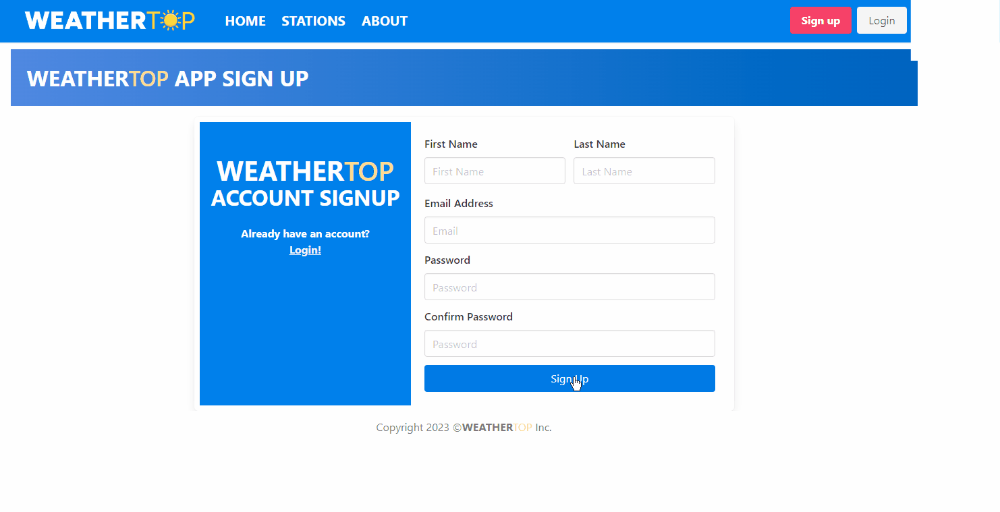
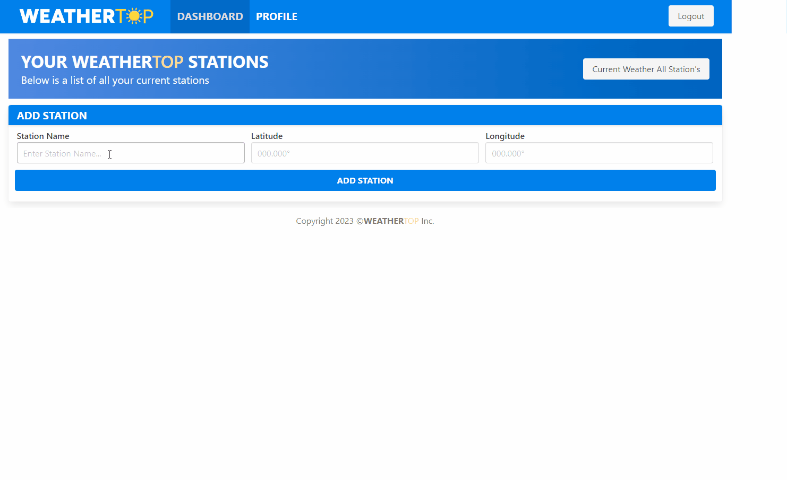
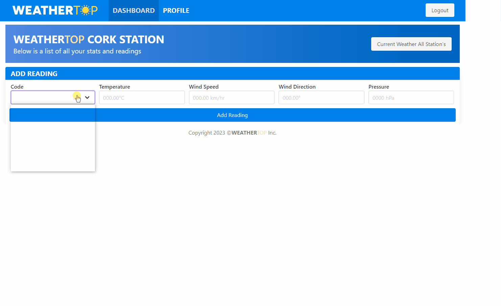
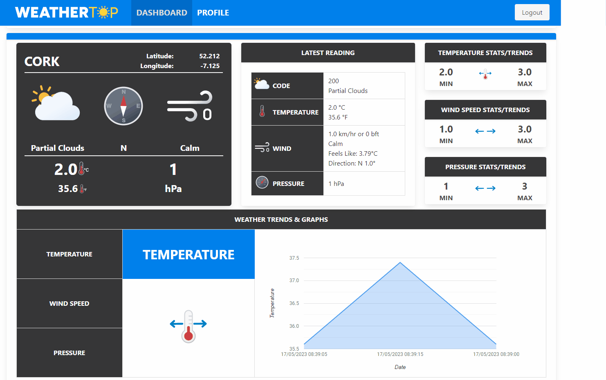

<a name="readme-top"></a>
<!-- PROJECT SHIELDS -->
<!-- PROJECT LOGO -->
<br />
<div align="center">
  <h1 align="center">Progamming Fundimentals & Web-Dev Assignment</h1>
    
</div>
<!-- TABLE OF CONTENTS -->
<details>
  <summary>Table of Contents</summary>
  <ol>
    <li>
      <a href="#about-the-project">About The Project</a>
      <ul>
        <li><a href="#developed-with">Developed With</a></li>
        <li><a href="#styled-with">Styled With</a></li>
      </ul>
    </li>
    <li>
      <a href="#features">Features</a>
      <ul>
        <li><a href="#prerequisites">Prerequisites</a></li>
        <li><a href="#installation">Installation</a></li>
      </ul>
    </li>
    <li><a href="#usage">Usage</a></li>
    <li><a href="#roadmap">Roadmap</a></li>
    <li><a href="#contributing">Contributing</a></li>
    <li><a href="#license">License</a></li>
    <li><a href="#contact">Contact</a></li>
    <li><a href="#acknowledgments">Acknowledgments</a></li>
  </ol>
</details>

<!-- ABOUT THE PROJECT -->
## About The Project
WeatherTop Inc. produce a modular weather station called the WeatherTop 1000. This lowcost device takes a set of meteorological readings and displays these on a simple LCD display. WeatherTop Inc. are seeking a Web companion application for the device. This document outlines my submission for this Assignment.
| Developed With| Styled With | 
| :----:        |    :----:   |
|     |        |
<p align="right">(<a href="#readme-top">back to top</a>)</p>

<!-- FEATURES -->
## User Accounts
 

### Account Features
- [x] Sign up and Login (both with Form Validation)
- [x] Loading from the data.yml
    - [x] Users 
    - [x] User Associated Stations
    - [x] User Associated Readings   
- [x] Profile
    - [x] Edit/Update Account
    - [x] Delete Account
<p align="right">(<a href="#readme-top">back to top</a>)</p>


## User Stations
 

### Station Features
- [x] Create Station (Name , Longitude, Latitude)
- [x] Delete Station
- [x] Station Displays
    - [x] Latest weather with SVG moving icons/images
    - [x] Temperature in Celsius & Fahrienheit
    - [x] Wind in km.hr & Bft (Beaufort)    
    - [x] Pressure in hPa
 - [x] Weather Min/Max Readings
 - [x] Weatehr Trends
<p align="right">(<a href="#readme-top">back to top</a>)</p>


## User Readings
 

### Reading Features
- [x] Create (Date/Time, Code, Temperature, Wind Speed, Wind Direction, Pressure)
- [x] Edit/Delete Readings
- [x] Station Displays
    - [x] Latest weather
    - [x] Temperature in Celsius & Fahrienheit
    - [x] Wind in km.hr & Bft (Beaufort)    
    - [x] Pressure in hPa
<br><br>
<p align="right">(<a href="#readme-top">back to top</a>)</p>


## Extras
 

### Extra Features
- [x] Create (Date/Time, Code, Temperature, Wind Speed, Wind Direction, Pressure)
- [x] Edit/Delete Readings
- [x] Station Displays

<br><br><br><br><br><br>
<p align="right">(<a href="#readme-top">back to top</a>)</p>


### Installation

1. Install [Play-1.6.0](https://github.com/playframework/play1/releases/download/1.6.0/play-1.6.0.zip) on your PC 
2. Clone the repo
   ```
   git clone https://github.com/ki321g/WeatherTOP
   ```
3. Open command prompt navigate to your project directory
4. Start Play application in the command prompt
 ```
   play run
   ```
6. Open Localhost URL
 ```
   http://localhost:9000/
   ``` 

<p align="right">(<a href="#readme-top">back to top</a>)</p>


<!-- CONTACT -->
## Contact

Your Name - Kieron Garvey

Project Link: [https://github.com/ki321g/WeatherTOP/](https://github.com/ki321g/WeatherTOP/)

<p align="right">(<a href="#readme-top">back to top</a>)</p>

<!-- ACKNOWLEDGMENTS -->
## Acknowledgments

* []()
* []()
* []()

<p align="right">(<a href="#readme-top">back to top</a>)</p>

<!-- MARKDOWN LINKS & IMAGES -->
<!-- https://www.markdownguide.org/basic-syntax/#reference-style-links -->
[product-screenshot]: readme/images/weathertop.gif
[features-account]: readme/images/weathertop_user.gif
[Play]: readme/images/play-logo.png
[Play-url]: https://www.playframework.com/
[Bulma]: https://img.shields.io/badge/React-20232A?style=for-the-badge&logo=react&logoColor=61DAFB
[Bulma-url]: readme/images/bulma-logo.png
